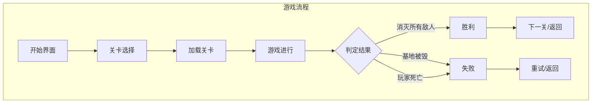

# 迭代一：关卡系统 + 基地保护

## 目标概述

复刻经典《坦克大战》的核心玩法：
- 关卡制游戏流程
- 保护基地（老鹰）不被摧毁
- 消灭所有敌人通关

---

## 功能模块分解

### 模块1: 关卡数据结构

创建 `src/Level.ts` 和关卡配置文件

```typescript
interface LevelConfig {
  id: string;
  name: string;
  playerStart: Vector3;
  base: BaseConfig;
  enemies: EnemySpawn[];
  obstacles: ObstacleConfig[];
  items?: ItemSpawn[];
}
```

### 模块2: 基地实体

创建 `src/Base.ts`

- 基地模型（老鹰造型或简化版）
- 生命值系统
- 被击中反馈
- 摧毁动画

### 模块3: 关卡管理器

扩展 `src/Game.ts` 或创建 `src/LevelManager.ts`

- 关卡加载
- 胜负判定
- 关卡切换

### 模块4: UI更新

- 关卡选择界面
- 关卡信息显示
- 胜利/失败界面

---

## 架构设计



---

## 文件变更清单

| 操作 | 文件路径 | 说明 |
|------|----------|------|
| 新增 | src/Base.ts | 基地实体类 |
| 新增 | src/Level.ts | 关卡数据类型定义 |
| 新增 | src/LevelManager.ts | 关卡管理器 |
| 新增 | src/levels/level1.json | 第一关配置 |
| 新增 | src/levels/level2.json | 第二关配置 |
| 新增 | src/levels/level3.json | 第三关配置 |
| 修改 | src/Game.ts | 集成关卡系统 |
| 修改 | src/Obstacle.ts | 添加障碍物类型 |
| 修改 | index.html | 添加关卡选择UI |

---

## 详细实现步骤

### 步骤1: 创建基地实体 (Base.ts)

```typescript
// 基地类核心属性
- mesh: THREE.Group (老鹰/旗帜造型)
- health: number (默认1，一击即毁)
- boundingBox: THREE.Box3
- isDestroyed: boolean
- destroy(): void (播放爆炸动画)
```

### 步骤2: 定义关卡数据结构 (Level.ts)

```typescript
// 类型定义
interface LevelConfig {
  id: string;
  name: string;
  mapSize: number;
  playerStart: {x, y, z};
  base: {position, rotation};
  enemies: Array<{type, position, delay}>;
  obstacles: Array<{type, position, size}>;
}
```

### 步骤3: 创建关卡管理器 (LevelManager.ts)

核心方法:
- loadLevel(levelId): 加载指定关卡
- clearLevel(): 清理当前关卡
- checkVictory(): 检查胜利条件
- checkDefeat(): 检查失败条件
- nextLevel(): 进入下一关

### 步骤4: 设计3个初始关卡

**Level 1 - 新手训练**
- 3个普通敌人
- 简单障碍物布局
- 基地有基础防护墙

**Level 2 - 正面交锋**
- 5个敌人（含1个快速型）
- 更复杂的地形
- 多个进攻路线

**Level 3 - 重重包围**
- 8个敌人（含重型）
- 迷宫式布局
- 需要策略性防守

### 步骤5: 修改Game.ts集成关卡系统

- 添加 GameState.LEVEL_SELECT
- 修改 startGame() 接受关卡参数
- 添加胜负判定逻辑
- 连接 LevelManager

### 步骤6: 更新UI界面

- 关卡选择网格
- 关卡锁定/解锁状态
- 胜利界面（显示分数、星级）
- 失败界面（重试按钮）

