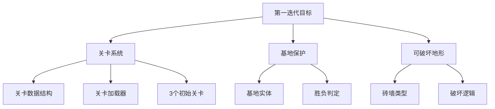

# 3D Tank Battle - 需求分析与迭代规划

## 1. 项目现状分析

### 1.1 已实现功能

| 模块 | 功能 | 状态 |
|------|------|------|
| 核心游戏 | 3D场景渲染 (Three.js) | ✅ 完成 |
| 核心游戏 | 玩家坦克控制 (WASD/方向键) | ✅ 完成 |
| 核心游戏 | 鼠标瞄准炮塔旋转 | ✅ 完成 |
| 核心游戏 | 射击系统 | ✅ 完成 |
| NPC系统 | 基础AI (巡逻/追击/攻击) | ✅ 完成 |
| NPC系统 | 自动生成敌人 | ✅ 完成 |
| 道具系统 | 护盾/火箭弹/急救包 | ✅ 完成 |
| 碰撞系统 | AABB碰撞检测 | ✅ 完成 |
| 视觉效果 | 粒子爆炸特效 | ✅ 完成 |
| 音效系统 | Web Audio API音效 | ✅ 完成 |
| UI系统 | HUD/开始/暂停/结束界面 | ✅ 完成 |

### 1.2 技术架构

```
src/
├── main.ts          # 入口文件
├── Game.ts          # 游戏主循环与状态管理
├── Tank.ts          # 坦克实体类
├── NPC.ts           # NPC AI控制
├── Projectile.ts    # 炮弹类
├── Item.ts          # 道具类
├── Obstacle.ts      # 障碍物类
├── InputManager.ts  # 输入管理
├── SoundManager.ts  # 音效管理
├── ParticleSystem.ts # 粒子系统
└── style.css        # 样式
```

### 1.3 当前游戏参数

- **地图大小**: 200x200
- **最大NPC数**: 5
- **玩家生命值**: 100
- **玩家伤害**: 20 (火箭弹加成后50)
- **护盾持续**: 10秒
- **火箭弹加成**: 15秒

---

## 2. README中的未来规划 (Roadmap)

根据 README.md 中列出的规划:

1. ⬜ **经典关卡模式** - 复刻《坦克大战》的经典地图布局
2. ⬜ **基地保护机制** - 增加老鹰(基地)保护任务
3. ⬜ **地形破坏系统** - 允许炮弹破坏部分砖墙障碍物
4. ⬜ **更多敌兵类型** - 增加移动速度快或装甲厚的特殊敌人
5. ⬜ **双人联机模式** - 支持本地或网络双人合作通关

---

## 3. 下一阶段迭代需求建议

### 3.1 优先级 P0 - 核心玩法增强

#### 3.1.1 经典关卡系统
- 创建关卡数据结构 (JSON配置)
- 实现关卡加载器
- 设计3-5个初始关卡
- 添加关卡选择界面
- 实现关卡通关/失败判定

#### 3.1.2 基地保护机制
- 创建基地实体 (Eagle/老鹰)
- 基地生命值系统
- 基地被摧毁 = 游戏失败
- 基地周围防护墙设计

### 3.2 优先级 P1 - 游戏深度

#### 3.2.1 可破坏地形
- 区分砖墙(可破坏)和钢墙(不可破坏)
- 实现砖墙分块破坏效果
- 添加破坏粒子特效

#### 3.2.2 敌人类型扩展
- 快速坦克 (高速/低血)
- 重型坦克 (低速/高血/高伤害)
- 精英坦克 (闪烁特效/掉落道具)

### 3.3 优先级 P2 - 体验优化

#### 3.3.1 视觉增强
- 坦克履带动画
- 护盾可视化效果
- 更丰富的爆炸特效
- 小地图/雷达系统

#### 3.3.2 音效完善
- 坦克移动音效
- 不同武器音效
- 背景音乐
- 音量控制

### 3.4 优先级 P3 - 高级功能

#### 3.4.1 双人模式 (本地)
- 分屏或共享屏幕
- 第二玩家键位配置
- 合作模式逻辑

---

## 4. 推荐的第一迭代范围

基于复杂度和用户价值，建议第一迭代聚焦:



---

## 5. 待确认问题

在开始实现前，需要与您确认:

1. **关卡设计风格**: 是否严格复刻经典FC坦克大战的俯视角布局，还是保持当前3D自由视角?
2. **关卡数量**: 第一版本计划多少个关卡?
3. **难度曲线**: 是否需要难度选择 (简单/普通/困难)?
4. **存档系统**: 是否需要保存游戏进度?
5. **移动端适配**: 是否需要考虑触屏控制?

---

*文档版本: 1.0*  
*更新日期: 2026-01-31*
